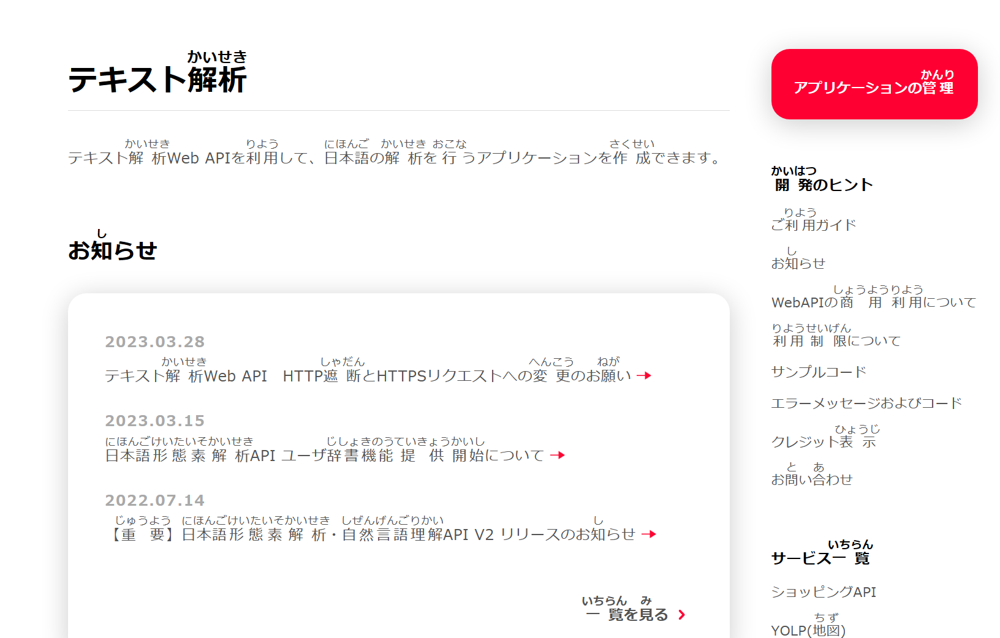

# 关于给日语pdf加上假名标注这件事

## 振り仮名
起因是一个B站网友给我评论说，有没有一种日语字体是自带假名的？

当时我第一反应就是没有，但我还是习惯性的查了一下，虽然确实没有这样的字体，但是得到了另外一个关键词：**振り仮名（furigana）**

从振り仮名出发，我找到了一个浏览器插件，效果就是下面这样子：

下载地址：https://github.com/EYHN/Furigana/releases

## latex

