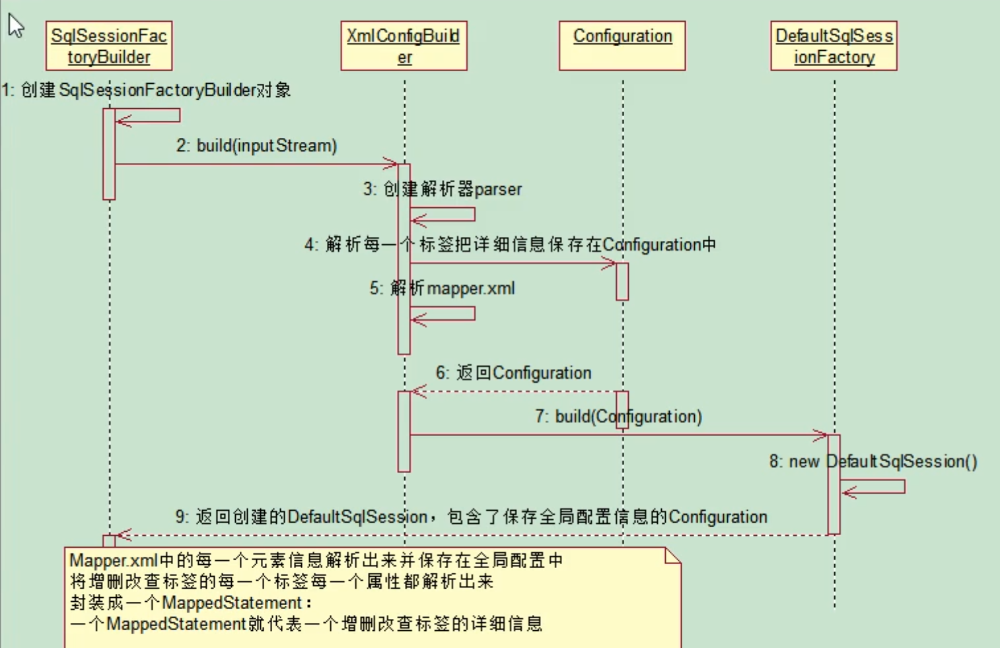

## 运行原理

### 概述
1. 创建sqlSessionFactory对象
2. 获取sqlSession对象
3. 获取接口的代理对象(MapperProxy)
4. 执行crud

### 构建sqlSessionFactory过程

1. 通过xmlConfiguration解析mybatis全局配置的xml文件，并将所有的配置信息存入Configuration类中
2. 使用Configuration对象创建SqlSessionFactory,mybatis中SqlSessionFactory是一个接口，
    但是mybatis提供了一个默认实现类
#### 构建Configuration对象
     先通过xml配置文件获取一个输入流inputStream，创建SqlSessionFactoryBuilder对象，

    build方法内部创建一个xmlConfiguration类型的解析器parser,

    调用parser.parse()方法解析全局配置文件的每一个标签，再解析mapper配置文件得到MapperProxyBuilder，

    返回Configuration对象

#### mapper内部组成
1. MappedStatement：保存一个映射器节点(select/insert/delete/update)
2. SqlSource: 是MappedStatement的一个属性，提供BoundSql
3. BoundSql：建立SQL语句和参数
#### 构建sqlSessionFactory对象
    SqlSessionFactoryBuilder.build(inputStream)返回sqlSessionFactory对象

