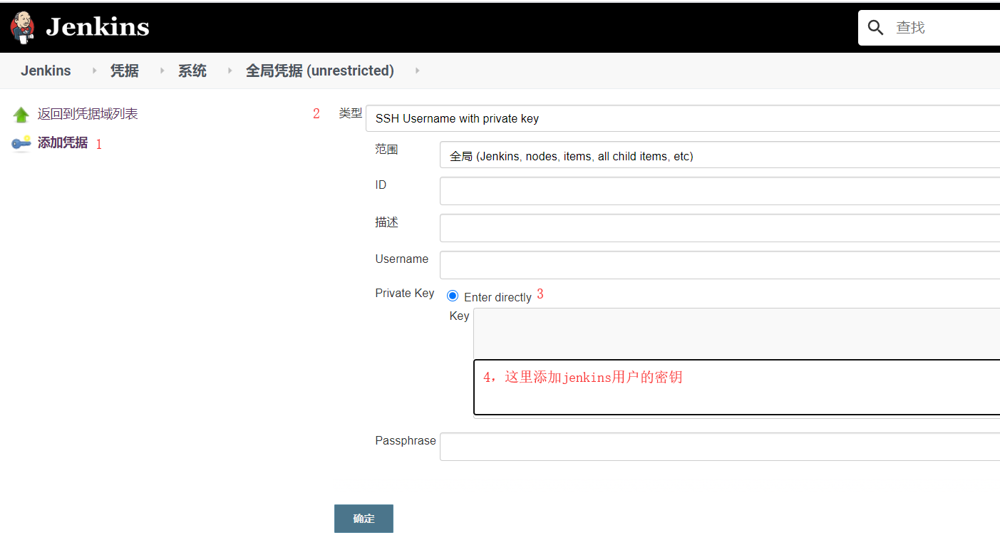
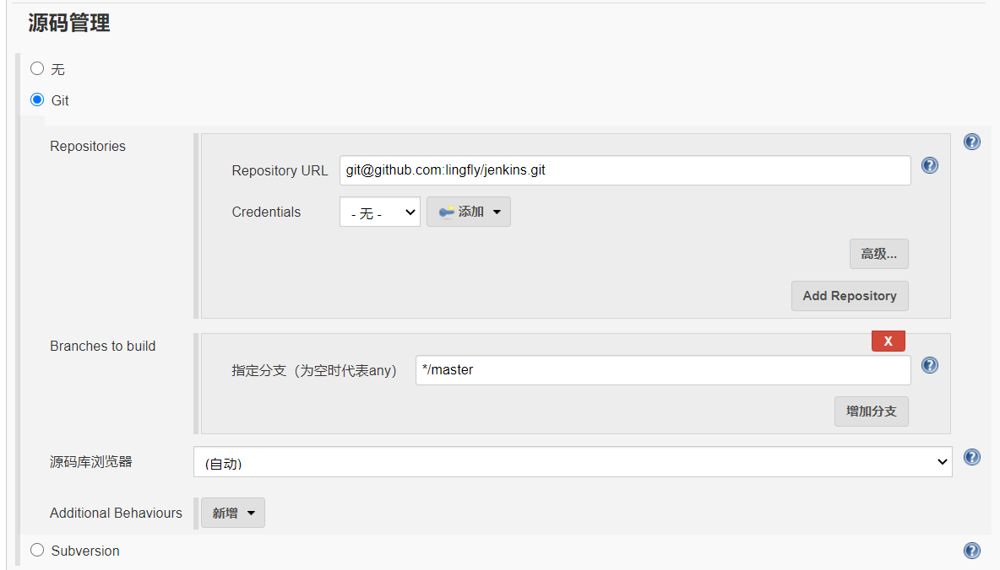
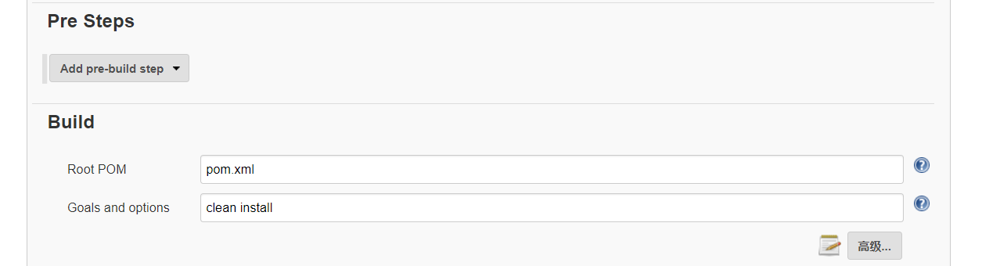

# 添加凭据



# 新建任务
1. 新建任务
2. 构建一个maven项目
	
3. 构建触发器

	Build whenever a SNAPSHOT dependency is built
4. build
	
5. Post steps
	

# 编写部署脚本

```shell
# /home/lingfly/script/jenkins/startup.sh
echo "Restarting SpringBoot Application"
pid=`ps -ef | grep jenkins-0.0.1-SNAPSHOT.jar | grep -v grep | awk '{print $2}'`
if [ -n "$pid" ]
then
   kill -9 $pid
   echo "关闭进程："$pid
fi

echo "授予当前用户权限"
# chmod 777 /var/lib/jenkins/workspace/jenkins-springboot/target/jenkins-0.0.1-SNAPSHOT.jar
echo "执行....."
nohup  java -jar /var/lib/jenkins/workspace/jenkins-springboot/target/jenkins-0.0.1-SNAPSHOT.jar  > device-temp.txt 2>&1 &

echo "启动成功"

ppid=`ps -ef | grep jenkins-0.0.1-SNAPSHOT.jar | grep -v grep | awk '{print $2}'`
echo "启动pid =$ppid"
echo "=================================="
```