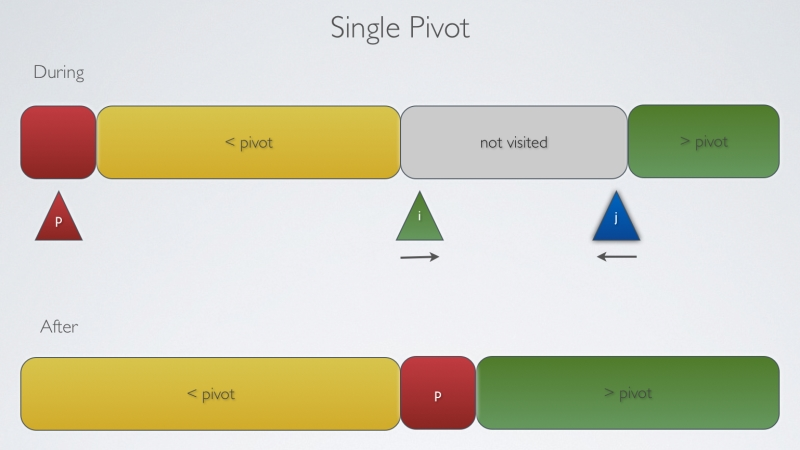
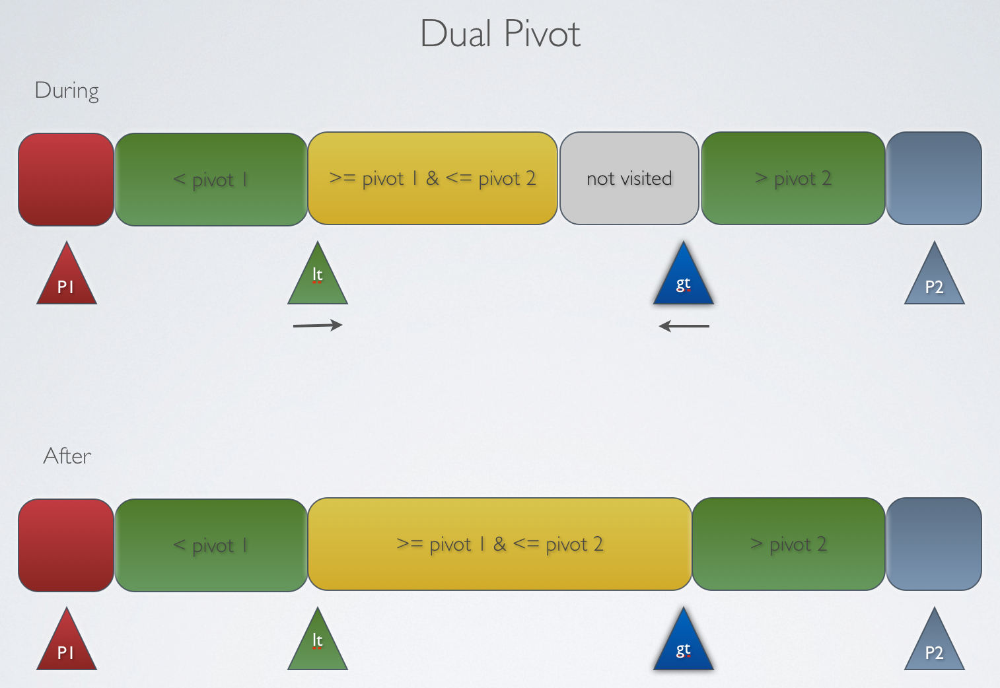

快速排序和归并排序思想相似

不同的是归并排序直接将数组等分，排序后利用辅助数组合并

快速排序选择一个元素作为切分元素，将数组根据切分元素分为两部分

左边小于等于切分元素，右边大于切分元素

并且在数组内进行合并，不需要辅助数组



特点：

+ 效率不稳定，最坏情况下每次切分出一个元素的子数组，复杂度O(n*n)

```java
void sort(int[] nums,int left,int right){
    if(left==right)return;
    int v=nums[left];
    int begin=left,end=right+1;
    while (true){
        while (nums[++begin]<=v);
        while (nums[--end]>v);
        if(begin>=end)break;
        swap(nums,begin,end);
    }
    swap(nums,left,end);

    sort(nums,left,end);
    sort(nums,begin,right);
}
```

优化：

1. 使用三数取中选择区分值

可以选取位置在第一，中间，最后的三个值然后取中间值作为区分值

2. 在子数组长度小于一定的阈值时，使用插入排序

插入排序在小数组里效率更优，jdk8.0的Arrays.sort()使用的插入排序阈值是INSERTION_SORT_THRESHOLD = 47

3. 三向切分

在序列中存在大量相同元素时，可以将序列分为三部分，分别是小于，等于，大于切分元素



4. 栈实现快速排序

递归实现会使用更多的时间和内存资源，可以使用栈实现优化

栈实现原理：

+ 用栈保存数组节点，节点保存数组的开始、结束位置信息
+ 当栈不为空，则一个节点出栈
+ 对出栈节点进行切分，再使长度大于1的子数组入栈

```java
void sort(int[] nums,int left,int right){
    Stack<Node> stack=new Stack<>();
    stack.push(new Node(left,right));
    while (!stack.empty()){
        Node node=stack.pop();
        int v=nums[node.begin];
        int begin=node.begin,end=node.end+1;
        //切分
        while (true){
            while (nums[++begin]<=v);
            while (nums[--end]>v);
            if(begin>=end)break;
            swap(nums,begin,end);
        }
        swap(nums,node.begin,end);

        //切分后子数组长度大于1则入栈
        if(node.begin<end){
            stack.push(new Node(node.begin,end));
        }
        if(begin<node.end){
            stack.push(new Node(begin,node.end));
        }
    }
}
//定义存放在栈中的节点
class Node{
    int begin,end;
    //begin，end分别为数组的开始，结束位置
    public Node(int begin, int end) {
        this.begin = begin;
        this.end = end;
    }
}

```

5. 双轴快速排序

使用两个轴值把数组切分为三部分，再分别进行排序

jdk8.0的快速排序就是使用双轴，先尽量把数组六等分，
然后取六部分的五个交界值做插入排序
再取第二和第四个作为轴值


参考链接

[QUICKSORTING - 3-WAY AND DUAL PIVOT](https://rerun.me/2013/06/13/quicksorting-3-way-and-dual-pivot/)

[CS-Notes](https://github.com/CyC2018/CS-Notes/blob/master/docs/notes/%E7%AE%97%E6%B3%95%20-%20%E6%8E%92%E5%BA%8F.md)