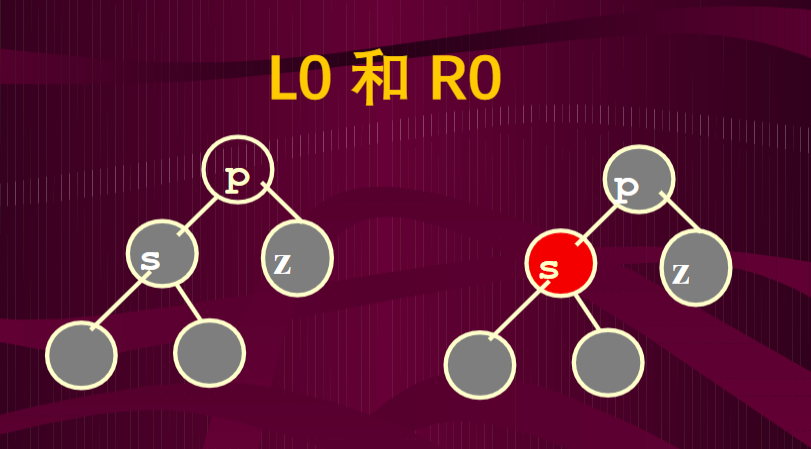
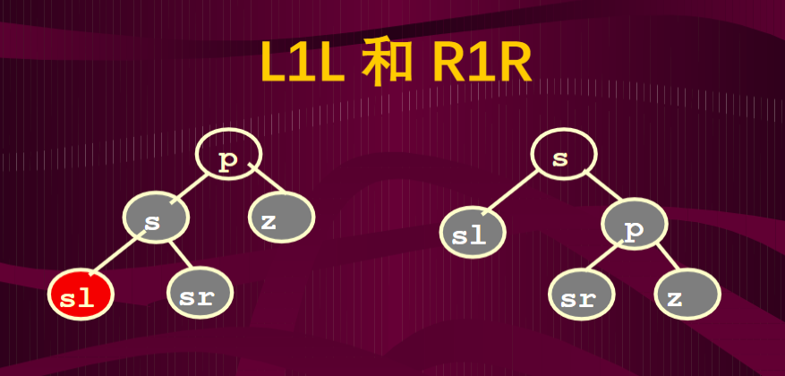
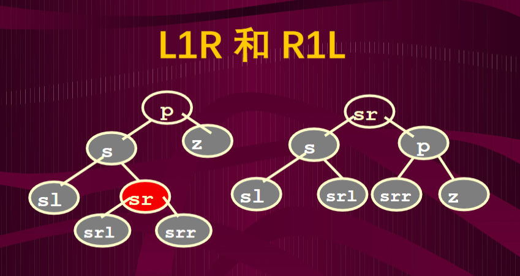
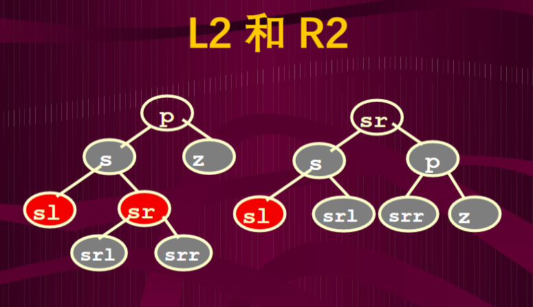
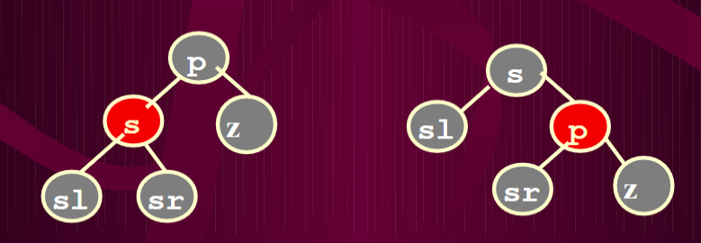

## 红黑树

### 性质
1. 每个节点着成红色或黑色
2. 根节点为黑色
3. 如果一个节点是红色的，那么它的子节点必须是黑色
4. 从一个节点到一个叶子节点(空节点)的每一条路径必须包含相同数量的黑色节点
5. 空节点为黑色

### 推论
1. 假定红黑树的节点数为n，那么高度为2log(n+1)
2. 从根节点到叶子节点的最长可能路径不多于最短可能路径的2倍长

性质4要求每条路径包含相同数量黑色节点，那么两条路径如果等长，则必不包含红色节点；且最短路径也比不包含红色节点；再根据性质3，红色节点不能连接出现，只能红黑交替，则最长可能路径就是红色节点等于黑色节点，为最短路径的2倍。

### 插入操作

1. 令插入节点为红色，因为插入一个黑色节点会破坏性质4
2. 如果父节点为黑色，则插入完毕
3. 如果父节点为红色，又分为父节点的兄弟节点(uncle)为红色和黑色两种情况
4. 如果uncle为黑色，则直接将父节点着为黑色，并执行一次旋转(一字形或之字形)
5. 如果uncle为红色，则将祖父节点着为红色，父节点和uncle着为黑色
6. 当祖父节点着为红色后，可能曾祖父为红色，违反了性质3，
这时相当于回到第3步，重复执行，这个过程称为上滤(上浮)
7. 如果上浮到根节点着为红色，则把根节点修改为黑色

### 删除操作
在二叉查找树的删除操作中，最终可以归结为两种情况
1. 对只有一个子节点的节点进行删除
2. 对叶子节点进行删除

因为对一个有2个子节点的节点删除时，会去搜索右子树的最小节点作为替代节点进行删除(该替代节点最多只有一个孩子)

在红黑树，可以对上述两种情况进行细分
1. 删除一个红色叶节点，直接删除
2. 删除只有一个孩子的节点，将孩子的颜色着为黑色

    因为只有一个孩子的节点，其孩子必为红色，则该节点必为黑色

3. 删除一个黑色叶节点

删除一个黑色节点会形成一个空节点，导致经过该节点的路径都少一个黑色节点(破坏性质4)，称这个节点为调整节点

删除黑色叶节点的情况又可以分为两种，调整节点的兄弟为红色或黑色

### 情况1：调整节点的兄弟为黑色
设兄弟节点为s，父节点为p，调整节点为z

情况1又分为4种情行

1. s没有红色孩子(空节点认为是黑色)

    

    如果p原来为红色，则p改为黑色，s改为红色，调整结束；

    如果p原来为黑色，删除z后原来经过z的路径必然少一个黑色节点

    把s改为红色后，p的左右子树都少一个黑色节点

    相当于把p作为调整节点接着调整

2. s有一个红色孩子，且孩子在外侧

    

    sl改为黑色，s改为p原来的颜色，p改为黑色，执行单旋转

3. s有一个红色孩子，且孩子在内侧

    

    sr改为p原来的颜色，p改为黑色，执行双旋转

4. s有两个红色孩子

    

    L2和L1R处理方式一样，R2和R1L一样

### 情况2：调整节点的兄弟为红色

    

    s改为黑色，p改为红色，执行单旋转即可转换为情况1

### 代码实现

```java
import java.util.Stack;

public class RedBlackTree {
    RedBlackNode root;
    public RedBlackTree(RedBlackNode root) {
        this.root = root;
    }
    public RedBlackTree() {
    }
    
    //在实现旋转时，子树的根会随着旋转而改变，而Java不能由形参改变实参指向的对象
    //这里使用返回值实现子树根的改变
    //左旋转
    private RedBlackNode LL(RedBlackNode t){
        RedBlackNode t1=t.left;
        t.left=t1.right;
        t1.right=t;
        return t1;
    }
    //右旋转
    private RedBlackNode RR(RedBlackNode t){
        RedBlackNode t1=t.right;
        t.right=t1.left;
        t1.left=t;
        return t1;
    }
    //左-右双旋转
    private RedBlackNode LR(RedBlackNode t){
        t.left=RR(t.left);
        t=LL(t);
        return t;
    }
    //右-左双旋转
    private RedBlackNode RL(RedBlackNode t){
        t.right= LL(t.right);
        t=RR(t);
        return t;
    }
    //旋转后使用reLink方法调整子树根的父亲的子节点
    private void reLink(RedBlackNode oldp,RedBlackNode newp,Stack<RedBlackNode> path){
        if(path.isEmpty()){
            root=newp;
        }
        else {
            RedBlackNode grandParent=path.pop();
            if(grandParent.left.equals(oldp)){
                grandParent.left=newp;
            }
            else{
                grandParent.right=newp;
            }
            path.push(grandParent);
        }
    }
    private void insertReBalance(RedBlackNode t,Stack<RedBlackNode> path){
        RedBlackNode parent,grandParent,uncle,rootOfSubTree;
        parent=path.pop();
        while (parent.color==0){
            //如果修改到根节点，直接把根节点着为黑色即可
            if(parent.equals(root)){
                parent.color=1;
                return;
            }
            grandParent=rootOfSubTree=path.pop();
            //确定uncle节点的位置
            if(grandParent.data>parent.data){
                uncle=grandParent.right;
            }
            else{
                uncle=grandParent.left;
            }
            //父亲的兄弟节点为黑
            if(uncle==null||uncle.color==1){
                //父亲为左子节点
                if(parent.equals(grandParent.left)){
                    if(t.equals(parent.left)){//LL
                        parent.color=1;
                        grandParent.color=0;
                        grandParent= LL(grandParent);
                    }
                    else{//LR
                        t.color=1;
                        grandParent.color=0;
                        grandParent= LR(grandParent);
                    }
                }
                else{//父亲为右子节点
                    if(t.equals(parent.right)){//RR
                        parent.color=1;
                        grandParent.color=0;
                        grandParent=RR(grandParent);
                    }
                    else{//RL
                        t.color=1;
                        grandParent.color=0;
                        grandParent=RL(grandParent);
                    }
                }
                reLink(rootOfSubTree,grandParent,path);
                return;
            }
            else{//父亲的兄弟节点为红
                grandParent.color=0;
                parent.color=1;
                uncle.color=1;
                if(root.equals(grandParent)){
                    root.color=1;
                    return;
                }
                t=grandParent;
                parent=path.pop();
            }
        }
    }
    private void removeReBalance(RedBlackNode t,Stack<RedBlackNode> path){
        RedBlackNode parent,sibling,rootOfSubTree;
        parent=rootOfSubTree=path.pop();
        while (parent!=null){
            if(parent.left.equals(t)){
                sibling=parent.right;
            }
            else {
                sibling=parent.left;
            }

            if(sibling.color==0){//兄弟节点为红色
                sibling.color=1;
                parent.color=0;
                if(parent.left.equals(t)){
                    parent= RR(parent);
                }
                else{
                    parent= LL(parent);
                }
                reLink(rootOfSubTree,parent,path);
                path.push(parent);
                parent=rootOfSubTree;
            }
            else {//兄弟节点为黑色
                if((sibling.left==null||sibling.left.color==1)&&(sibling.right==null||sibling.right.color==1)){
                    //L0,R0
                    sibling.color=0;
                    if(parent.color==0){
                        parent.color=1;
                        return;
                    }
                    else {
                        t=parent;
                        if(t.equals(root))return;
                        else parent=rootOfSubTree=path.pop();
                    }
                }
                if(parent.left.equals(t)){//兄弟是右孩子
                    if(sibling.left!=null&&sibling.left.color==0){
                        //R1L or R2
                        sibling.left.color=parent.color;
                        parent.color=1;
                        parent= RL(parent);
                        reLink(rootOfSubTree,parent,path);
                    }
                    else {
                        //R1R
                        sibling.color=parent.color;
                        sibling.right.color=1;
                        parent.color=1;
                        parent= RR(parent);
                        reLink(rootOfSubTree,parent,path);
                    }
                }
                else{//兄弟是左孩子
                    if(sibling.right!=null&&sibling.right.color==0){
                        //L1R or L2
                        sibling.right.color=parent.color;
                        parent.color=1;
                        parent= LR(parent);
                        reLink(rootOfSubTree,parent,path);
                    }
                    else {//L1L
                        sibling.color=parent.color;
                        sibling.left.color=1;
                        parent.color=1;
                        parent= LL(parent);
                        reLink(rootOfSubTree,parent,path);
                    }
                }
            }
        }
    }
    public void insert(int x){
        //插入和删除都用一个栈维护访问路径
        Stack<RedBlackNode> path=new Stack<>();
        RedBlackNode t,parent;
        if(root==null){
            root=new RedBlackNode(x,null,null,1);
            return;
        }
        t=root;
        while (t!=null&&t.data!=x){//查找插入位置
            path.push(t);
            if(t.data<x)t=t.right;
            else t=t.left;
        }
        if(t!=null)return;
        t=new RedBlackNode(x,null,null,0);
        parent=path.pop();
        if(x<parent.data)parent.left=t;
        else parent.right=t;
        if(parent.color==1)return;//如果插入节点的父节点为黑，插入完毕直接返回
        path.push(parent);
        insertReBalance(t,path);
    }
    public void remove(int x){
        Stack<RedBlackNode> path=new Stack<>();
        RedBlackNode t=root,old,parent=null;
        //查找x对应的节点
        while (t!=null&&t.data!=x){
            path.push(t);
            if(t.data>x)t=t.left;
            else t=t.right;
        }
        if(t==null)return;
        //如果有两个子节点，则寻找替代节点
        //替代节点为右子树的最小节点，该节点最多只有一个子节点
        if(t.left!=null&&t.right!=null){
            path.push(t);
            old=t;
            t=t.right;
            while (t.left!=null){
                path.push(t);
                t=t.left;
            }
            old.data=t.data;
        }
        if(t.equals(root)){
            root=t.left!=null?t.left:t.right;
            if(root!=null)root.color=1;
            return;
        }
        parent=path.pop();
        old=t;
        //删除替代节点，并把替代节点的子树连接到它的父节点上
        t=t.left!=null?t.left:t.right;
        if(parent.left.equals(old))parent.left=t;
        else parent.right=t;
        if(old.color==0){
            //如果替代节点为红色，则删除完毕
            old=null;
            return;
        }
        old=null;
        if(t!=null){
            //如果替代节点有一个红色子节点，则将其颜色着为黑
            //(如果红黑树的节点只有一个孩子，则孩子的颜色必为红色)
            t.color=1;
            return;
        }
        //如果不是以上情况，则需要调整
        path.push(parent);
        removeReBalance(t,path);
    }
    //中序遍历
    public void middleTrie(RedBlackNode t){
        if (t==null)return;
        middleTrie(t.left);
        System.out.printf("%d,%s  ",t.data,t.color==0?"红":"黑");
        middleTrie(t.right);
    }
}
//红黑树节点定义
class RedBlackNode{
    int data;
    RedBlackNode left;
    RedBlackNode right;
    int color;

    public RedBlackNode(int data, RedBlackNode left, RedBlackNode right, int color) {
        this.data = data;
        this.left = left;
        this.right = right;
        this.color = color;
    }
}

```